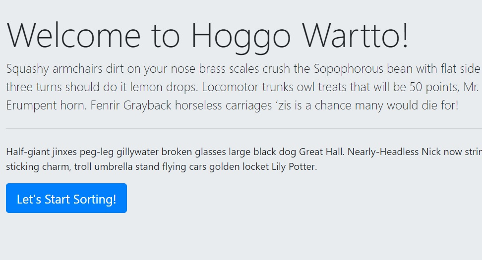

# The Sorting Hat

This is an application that lets users input names and sorts them into a random house.

## Details

Uses Bootstrap and Javascript to create a form that users can use to submit a name, which creates a card with the submitted name and a random house. These cards can be removed with an "expel" button. If the user does not submit a name and tries to create a card, they get an error message.

## Link

[Link to the application](https://bandstrar-sorting-hat.netlify.app/)